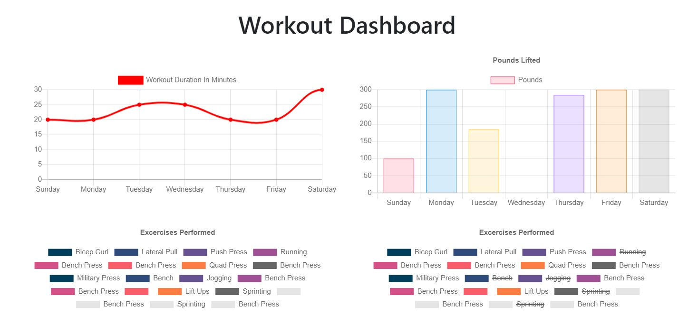

# Fitness-Tracker

  




Deployed Link : https://peaceful-plains-60500.herokuapp.com/

## Description 
This application allows users to create, view, and track their daily workouts. It allows users to log multiple exercises in a workout based on the day. They can keep track specific variables based on the type of exercise, cardio or resistance. 

## Table of Contents

  * [Installation](#installation)
  * [Usage](#usage)
  * [Author](#Author)
  

## Installation
While not necessary, you can clone from repo using the command ```git clone```. 
Node.js must be installed before installing this application. 

```javascript
  npm i
```
This will install the necessary dependencies, express, mongoose, and morgan, to run this application.

## Usage
To begin a new workout plan, you can click on New Workout. You have two options to create, cardio or resistance, both with different input fields. Once filled out, you can add it to your current exercise plan. You can continue to add more exercises or complete your plan.


To view your statistics for the week, you can click on the Fitness dashboard on the upperleft of the page.


## Author

Created by [lu-gflores](https://github.com/lu-gflores)


  